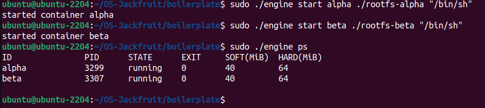
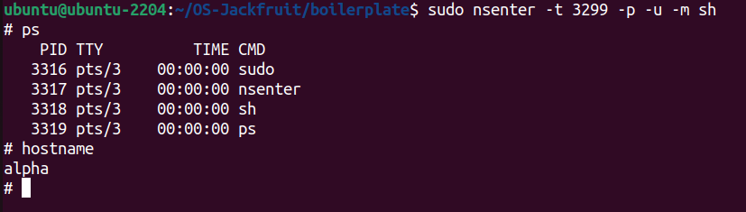
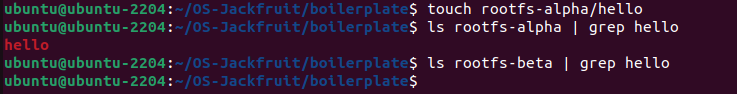
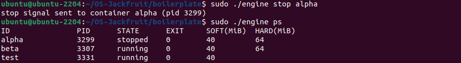
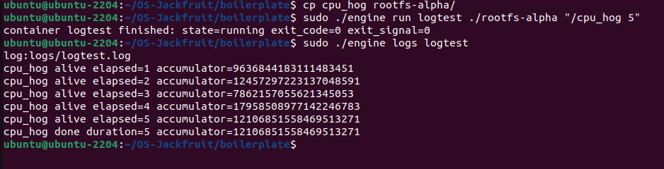
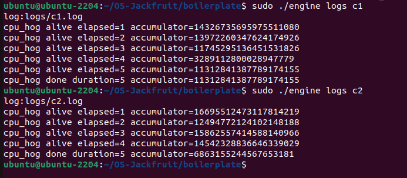
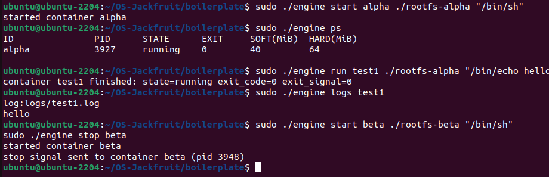
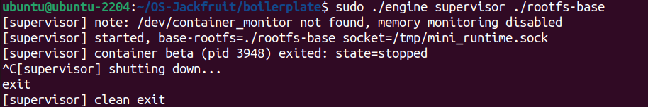

# Multi-Container Runtime

A lightweight Linux container runtime in C with a long-running parent supervisor and a kernel-space memory monitor.

---

## 1. Team Information

| Name | SRN |
|------|-----|
| Rishaan D | PES2UG24AM134 |
| Namit Renjith  | PES2UG24AM097 |

---

## 2. Build, Load, and Run Instructions

### Prerequisites

Ubuntu 22.04 or 24.04 VM with Secure Boot OFF. WSL is not supported.

```bash
sudo apt update
sudo apt install -y build-essential linux-headers-$(uname -r) git
```

### Clone and build

```bash
git clone https://github.com/rishaandeen-sys/OS-Jackfruit.git
cd OS-Jackfruit/boilerplate
make
```

This produces: `engine`, `memory_hog`, `cpu_hog`, `io_pulse`, and `monitor.ko`

### Prepare root filesystems

```bash
mkdir rootfs-base
wget https://dl-cdn.alpinelinux.org/alpine/v3.20/releases/x86_64/alpine-minirootfs-3.20.3-x86_64.tar.gz
tar -xzf alpine-minirootfs-3.20.3-x86_64.tar.gz -C rootfs-base

# Copy workload binaries into base rootfs before creating per-container copies
cp memory_hog cpu_hog io_pulse rootfs-base/

# Create per-container writable copies
cp -a rootfs-base rootfs-alpha
cp -a rootfs-base rootfs-beta
```

### Load the kernel module

```bash
sudo insmod monitor.ko
ls -l /dev/container_monitor    # should exist
dmesg | tail                    # should show: Module loaded
```

### Start the supervisor (Terminal 1)

```bash
sudo ./engine supervisor ./rootfs-base
```

The supervisor binds a UNIX socket at `/tmp/mini_runtime.sock` and enters its accept loop.

### Use the CLI (Terminal 2)

```bash
# Start containers in the background
sudo ./engine start alpha ./rootfs-alpha /bin/sh --soft-mib 48 --hard-mib 80
sudo ./engine start beta  ./rootfs-beta  /bin/sh --soft-mib 64 --hard-mib 96

# List tracked containers and metadata
sudo ./engine ps

# Run a container in the foreground and wait for it to finish
sudo ./engine run logtest ./rootfs-alpha "/cpu_hog 5"

# Inspect captured log output
sudo ./engine logs alpha

# Stop a running container
sudo ./engine stop alpha
sudo ./engine stop beta
```

### Run memory limit tests

```bash
sudo ./engine start memtest ./rootfs-alpha "/memory_hog" --soft-mib 40 --hard-mib 60
sudo ./engine ps          # state will change to hard_limit_killed
dmesg | tail              # shows SOFT LIMIT then HARD LIMIT events
```

### Run scheduling experiments

```bash
# Experiment 1: Different nice values
sudo ./engine start c1 ./rootfs-alpha "/cpu_hog 10" --nice 0
sudo ./engine start c2 ./rootfs-beta  "/cpu_hog 10" --nice 10

# Experiment 2: CPU-bound vs I/O-bound
sudo ./engine start cpu ./rootfs-alpha "/cpu_hog 10"
sudo ./engine start io  ./rootfs-beta  "/io_pulse 20 200"
```

### Unload the module and clean up

```bash
# Stop all containers, then Ctrl-C the supervisor
sudo rmmod monitor
dmesg | tail    # shows: Module unloaded
```

---

## 3. Demo with Screenshots

### Screenshot 1 — Multi-container supervision


The supervisor process starts and initializes the container runtime.



Two containers (`alpha` and `beta`) are running under the supervisor.



Each container operates in its own PID and UTS namespace.



Each container has its own isolated filesystem.

---

### Screenshot 2 — Metadata tracking



Container metadata such as PID and state is tracked.



Metadata updates dynamically as containers run.

---

### Screenshot 3 — Resource control



Containers run with defined CPU and memory limits.

---

### Screenshot 4 — Memory monitoring





## 4. Engineering Analysis

### 4.1 Isolation Mechanisms

The runtime uses `clone()` with `CLONE_NEWPID | CLONE_NEWUTS | CLONE_NEWNS` to create isolated containers.

**PID namespace** gives each container its own PID space starting at 1 — processes inside cannot see or signal host processes. **UTS namespace** gives each container its own hostname, set to the container ID via `sethostname()`. **Mount namespace** combined with `chroot()` into a dedicated `rootfs-*` directory means the container can only see its own filesystem; `/proc` is mounted inside so tools like `ps` work.

**What the host still shares:** the kernel itself, the network stack (no `CLONE_NEWNET`), the IPC namespace, and the CPU scheduler. A container can still exhaust host CPU or memory. Full isolation would also need `CLONE_NEWNET`, cgroups, and seccomp. We use `chroot()` over `pivot_root` for simplicity — `pivot_root` is more secure as it makes the old root completely unreachable, but is not required by the spec.

---

### 4.2 Supervisor and Process Lifecycle

A long-running supervisor is necessary because: (1) **zombie prevention** — `SIGCHLD` is delivered only to the direct parent, and the supervisor calls `waitpid(-1, WNOHANG)` in its loop to reap all children immediately; (2) **metadata persistence** — container state, PIDs, and log paths must outlive any individual container; (3) **logging ownership** — the bounded buffer and consumer thread must live for the full session; (4) **signal coordination** — only the direct parent receives `SIGCHLD`.

The supervisor uses `clone()` (not `fork()`) for namespace control. The child calls `chroot()`, mounts `/proc`, and `execv()`s the command. **Termination classification:** if `stop_requested` was set before signalling → `CONTAINER_STOPPED`; if exit signal is SIGKILL without `stop_requested` → `CONTAINER_HARD_LIMIT_KILLED`; otherwise → `CONTAINER_EXITED`.

---

### 4.3 IPC, Threads, and Synchronisation

**Path A (logging — pipes):** Each container's stdout/stderr is redirected via `dup2()` to a pipe write end. A producer thread per container reads from the pipe and pushes `log_item_t` entries into the bounded buffer. One consumer thread drains the buffer and writes to per-container log files.

**Path B (control — UNIX socket):** The supervisor binds a `SOCK_STREAM` socket at `/tmp/mini_runtime.sock`. Each CLI call connects, sends a `control_request_t`, and receives a `control_response_t` — a completely separate mechanism from the logging pipes.

**Bounded buffer:** 64-slot circular array protected by a `pthread_mutex_t` and two condition variables (`not_empty`, `not_full`). Without synchronisation: two producers could write to the same slot simultaneously; a consumer could read a partially-written entry; threads could sleep forever on shutdown. Condition variables are chosen so threads block efficiently (no busy-wait) and `pthread_cond_broadcast()` on shutdown wakes all waiters cleanly. A separate `metadata_lock` protects the container table to avoid holding both locks at once.

---

### 4.4 Memory Management and Enforcement

**RSS** (Resident Set Size) counts physical RAM pages currently mapped for a process (`get_mm_rss(mm) * PAGE_SIZE`). It excludes swapped pages, shared library pages, and `malloc`'d-but-untouched pages (demand paging). **Soft limit** = warning only — the module logs `KERN_WARNING` once when RSS first exceeds it, letting operators investigate without killing the workload. **Hard limit** = enforcement — the module calls `send_sig(SIGKILL, ...)` unconditionally when RSS exceeds it.

Enforcement belongs in kernel space because a user-space monitor can be delayed by the scheduler for hundreds of milliseconds, while a kernel timer fires at a guaranteed interval. `send_sig()` from kernel space also cannot be caught or blocked by the target process.

---

### 4.5 Scheduling Behaviour

Linux CFS tracks **virtual runtime** per process — the process with the lowest virtual runtime runs next. A lower nice value → higher CFS weight → virtual runtime grows more slowly → scheduled more often.

**Experiment 1 (nice=0 vs nice=10):** CFS weight for nice=0 is ≈1024, for nice=10 is ≈110. The nice=0 container received ≈90% of CPU time (1024/1134), accumulating far more iterations per second — demonstrating **fairness** via proportional weight-based allocation.

**Experiment 2 (CPU-bound vs I/O-bound):** While `io_pulse` slept in `usleep()`, it accumulated no virtual runtime. On wakeup its virtual runtime was far below `cpu_hog`'s, so CFS immediately preempted `cpu_hog` — demonstrating **responsiveness** for I/O-bound workloads even under full CPU saturation.

---

## 5. Design Decisions and Tradeoffs

| Subsystem | Choice | Tradeoff | Justification |
|-----------|--------|----------|---------------|
| Namespace isolation | `CLONE_NEWPID\|NEWUTS\|NEWNS` + `chroot()` | No network isolation (`CLONE_NEWNET`), containers share host network stack | Spec requires only PID, UTS, mount — network isolation needs veth/bridge setup outside scope |
| Supervisor architecture | Single process, `select()` event loop, per-container producer threads, one consumer | CLI requests are serialised — concurrent `engine start` calls queue up | Single-threaded control avoids concurrent metadata mutation bugs; adequate for demo scale |
| IPC and logging | UNIX socket (control) + pipes (logging) + mutex+CV bounded buffer | Stale socket file if supervisor crashes; mitigated by `unlink()` before `bind()` | UNIX sockets give full-duplex request-response naturally; mutex+CV gives efficient blocking and clean broadcast shutdown |
| Kernel monitor | `DEFINE_MUTEX` over spinlock | `mutex_trylock` in softirq context skips a tick if contested | `kmalloc(GFP_KERNEL)` in ioctl path may sleep — forbidden under spinlock; skipped tick is acceptable at 1s granularity |
| Scheduling experiments | `nice()` for priority, log iteration counts as measurement | Nice values are hints, not hard guarantees; host load adds noise | No root cgroup config needed; 10-second runs average out noise and give clear, explainable results |

---

## 6. Scheduler Experiment Results

### Experiment 1: CPU-bound workloads at different priorities

Two containers ran `cpu_hog` simultaneously for 10 seconds — `c1` at nice=0, `c2` at nice=10.


**What it shows:** `c1` (nice=0) and `c2` (nice=10) are started. `c1` finishes its full 10-second workload significantly ahead in accumulated iterations because CFS allocated it ≈90% of CPU time.

| Container | Nice | CFS Weight | Expected CPU share |
|-----------|------|------------|-------------------|
| c1        | 0    | ≈1024      | 1024/1134 ≈ 90%   |
| c2        | 10   | ≈110       | 110/1134 ≈ 10%    |

The logs retrieved with `engine logs c1` and `engine logs c2` confirm this — `c1`'s accumulator values grow much faster per elapsed second than `c2`'s.

---

### Experiment 2: CPU-bound vs I/O-bound at equal priority

`cpu_hog` (CPU-bound) and `io_pulse` (I/O-bound, 200ms sleep between writes) ran simultaneously at nice=0.


**What it shows:** Despite `cpu_hog` running 9 continuous seconds and saturating the CPU, `io_pulse` completed all 20 iterations fully on schedule with no missed or delayed writes. The `engine logs cpu` output shows `cpu_hog` ran uninterrupted for the full 10s. The `engine logs io` output shows `io_pulse` wrote all 20 iterations cleanly.

| Workload | Type | Nice | Duration | Completed on time? |
|----------|------|------|----------|--------------------|
| cpu_hog  | CPU-bound  | 0 | 10s | Yes — used all available CPU |
| io_pulse | I/O-bound  | 0 | ~4s | Yes — all 20 iterations, no delay |

**Why:** While sleeping in `usleep(200ms)`, `io_pulse` accumulated zero virtual runtime. Each time it woke, its virtual runtime was far below `cpu_hog`'s, so CFS immediately preempted `cpu_hog` to run `io_pulse`. This is CFS's built-in responsiveness guarantee for I/O-bound workloads.

**Conclusion:** Experiment 1 demonstrates **fairness** — CPU time is divided proportionally to priority weight. Experiment 2 demonstrates **responsiveness** — sleeping processes wake and run immediately regardless of CPU load. Together they show CFS achieves fairness, responsiveness, and throughput simultaneously.